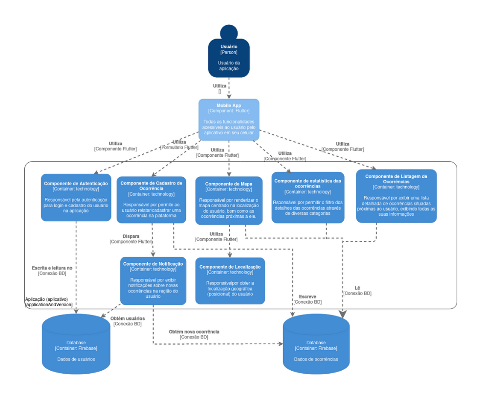

# ProjetoMC426
O projeto em questão tem como objetivo fazer um sistema de consulta sobre os dados de segurança de Barão Geraldo, exibindo um mapa, centrado no usuário, que mostra zonas mais e menos seguras, bem como estatísticas de lugares e horários com maior e menor segurança.

**Integrantes:**
| Nome                           | R.A.   |
|:------------------------------:|:------:|
| João Augusto Pimentel Barbosa  | 248341 |
| João Victor de Oliveira Pátaro | 237763 |
| Mateus de Padua Vicente        | 239829 |
| Vítor de Melo Calhau           | 248740 |

# Descrição da Arquitetura
Estilo arquitetural adotado: MVC (Model-View-Controller), visando dividir a aplicação em 3 módulos independentes que possuem suas próprias responsabilidades e funcionalidades, a Model (que possui os modelos de dados e serviços da aplicação), a View (parte da interface gráfica com o usuário, o "front-end") e os Controllers (controlador que é responsável por sincronizar o modelo com o front-end, passando os dados necessários para que os resultados das operações dos serviços sejam mostrados corretamente).

Para a parte do padrão de projeto, escolhemos adotar um para o componente de estatísticas de ocorrências. O padrão escolhido foi o padrão comportamental Strategy, que define um grupo de algoritmos, encapsula cada um deles e os torna intercambiáveis, permitindo que eles variem independentemente das classes que irão utilizá-los e compartimentando as responsabilidades. No nosso caso, teremos querys para puxar os dados de ocorrências de acordo com os filtros escolhidos pelo usuário. Podemos criar uma interface chamada Estatistica que contém o método ObterEstatistica e executá-lo em uma classe específica apenas para executar querys, e implementamos as querys específicas por filtragem (teríamos uma classe para cada tipo de filtragem, cada qual possuirá seus próprios métodos para criar a query de acordo com os dados escolhidos pelo usuário). Com isso, conseguimos que a classe de executar querys não seja alterada caso surja um novo filtro, já que ela não depende dos filtros, apenas da abstração, deixando um caminho mais fácil para evoluirmos com a aplicação.

# Diagrama em Nível de Componentes

  </img>

O diagrama da aplicação é composto pelos seguintes componentes:
- Componente de autenticação do usuário: responsável por gerenciar o cadastro e login de usuários e, consequentemente, salvando as informações no banco de dados.
- Componente de cadastro de ocorrências: responsável por permitir aos usuários expor o acontecimento de um caso/ocorrência, descrevendo suas informações, tais quais localização, tipo de ocorrência, etc, salvando as informações no banco de dados.
- Componente de notificação: responsável por exibir notificações ao usuário sobre novas ocorrências perto da região dele.
- Componente de mapa: responsável por renderizar o mapa centrado na localização do usuário, bem como as ocorrências próximas a ele.
- Componente de localização: responsável por obter a localização atual do usuário.
- Componente de estatística das ocorrências: responsável por permitir o filtro dos detalhes das ocorrências através de diversas categorias e analisar esses dados.
- Componente de listagem das ocorrências: responsável por exibir uma lista detalhada de ocorrências situadas próximas ao usuário, exibindo todas as suas informações (feed/mural).
