## Features a serem desenvolvidas no projeto:
  1. Mapa de ocorrências: os usuários podem cadastrar ocorrências de assaltos que eles sofreram, fazendo uma descrição contendo data, hora, local, objeto roubado e possivelmente uma descrição breve do assaltante. A partir dessa ocorrência cadastrada, o aplicativo terá um mapa que mostrará uma marcação indicando o local da ocorrência, onde outros usuários poderão clicar para saber o que aconteceu e se informarem sobre. Em locais com muitos casos, o mapa ficará colorido, ficando vermelho em lugares perigosos.
  2. Estatísticas de ocorrências: uma aba contendo dados sobre ocorrências cadastradas, onde o usuário poderá ver os dados de acordo com sua preferência. A partir disso e dos dados coletados, o aplicativo criará tabelas e gráficos contendo estatísticas sobre os casos, como locais e horários mais perigosos e itens mais visados pelos assaltantes.
  3. Mural com notícias importantes: uma aba que possui um mural onde os usuários poderão publicar e conferir notícias importantes sobre o local onde vivem, como por exemplo reportagens sobre crimes ocorridos recentemente ou notícias sobre a vizinhança.

## Registro da execução da técnica de elicitação de requisitos
### Técnica escolhida: BENCHMARKING

Durante a elicitação de requisitos foram observadas diferentes soluções similares/concorrentes e, também, outros casos que poderiam agregar ao nosso produto. A seguir serão apresentados os resultados das pesquisas e estudos através da técnica de benchmarking. A maioria dos produtos concorrentes foram baixados e testados, a fim de obter uma avaliação mais próxima e fiel da usabilidade e cumprimento dos objetivos propostos.

Aplicações para segurança conhecidas no mercado:
- **B.O Coletivo:** Registre ocorrências como furtos, roubos e sequestros em um mapa coletivo e consulte a situação dos locais de interesse. O app conta também com uma seção de telefones úteis, com contatos da Polícia Militar, do Corpo de Bombeiros e do Samu.

- **Onde Fui Roubado:** A plataforma colaborativa mapeia roubos, furtos e outros crimes pelo Brasil. Anonimamente os usuários podem fazer consultas de informações por regiões e sinalizar ocorrências. Assim, é possível ter uma ideia de quais regiões da sua cidade são mais perigosas, em qualquer horário do dia, e o melhor caminho para evitá-las. Também funciona no computador.

  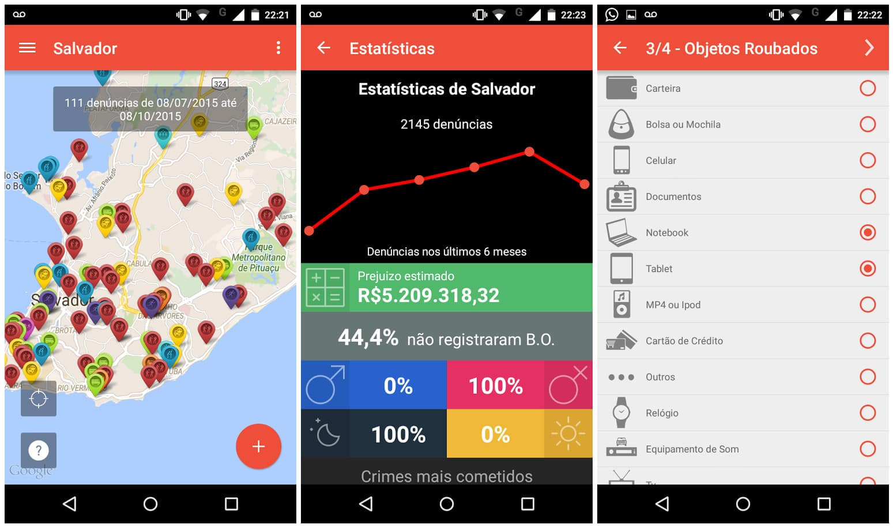</img>

- **Sinesp Cidadão:** Aplicativo desenvolvido pelo Serviço Federal de Processamento de Dados (Serpro) e ligado à Secretaria Nacional de Segurança Pública do Ministério da Justiça, o aplicativo é um módulo do Sinesp (Sistema Nacional de Informações de Segurança Pública, Prisionais e sobre Drogas). Ele tem o objetivo de facilitar o acesso à informações sobre segurança a nível federal. Ele possui integração direta com o sistema gov.br do governo federal. No app, estão disponíveis relatórios de buscas de pessoas desaparecidas, mandados de prisão, placas de veículos roubados, entre outras coisas. Permite que o cidadão consulte roubos ou furtos de qualquer veículo no Brasil graças a uma parceria com o Denatran (Departamento Nacional de Trânsito) No aplicativo há uma funcionalidade, também, para informar que seu veículo foi roubado e cadastrar sua placa no banco de dados.

  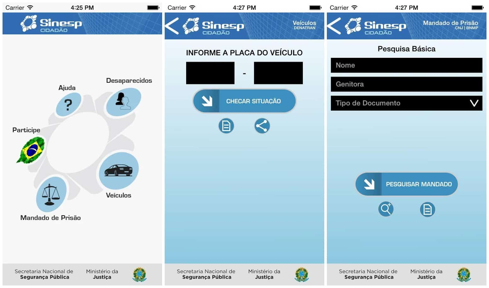</img>
  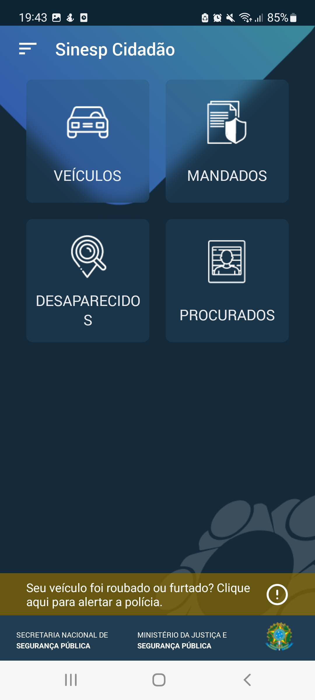</img>

- **Cerberus Antirroubo:** Um dos melhores para rastrear um celular roubado. Além de mostrar a localização do aparelho, é possível tirar foto de quem o está utilizando, gravar áudio do ambiente e ver as redes Wi-Fi nas quais o smartphone está conectado. Atualmente a plataforma só está disponível para Android.
- **PM com você:** Aplicativo desenvolvido com o objetivo de, com base na sua localização, mostrar os postos militares mais próximos, tanto de bombeiros, polícia rodoviária, polícia militar e ambiental.

  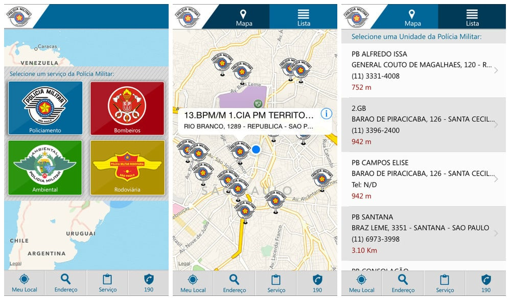</img>

- **Neighbor Shield: Aplicativo de segurança de bairros (projeto acadêmico, disponível em: https://ric.cps.sp.gov.br/bitstream/123456789/9947/1/Informatica_2022-1_Lucas%20Fuliaro%20Gambini_Neighhor%20Shield.pdf):** É um aplicativo de segurança pública, onde os próprios moradores de determinada região colaboram com notificações, registram ocorrências e compartilham avisos que determinam áreas mais ou menos perigosas. Foi pensado para auxiliar as pessoas a se proteger da violência, por meio de ações preventivas realizadas por uma comunidade. Essas ações terão como base os dados e informações disponibilizados pelo aplicativo, que irá contar com um sistema de entrada e análise de dados enviados pelos usuários, gerando estatísticas personalizadas dos índices de violência de acordo com a região onde o usuário reside. Esses dados poderão ser aproveitados pela comunidade para que seja possível a articulação dos indivíduos contra a ação de criminosos dentro de seus bairros, possibilitando até mesmo que autoridades competentes de segurança possam aproveitar as informações contidas nestes registros para melhorar a segurança nas regiões mais afetadas pela violência.

Aplicações com funcionalidades similares às planejadas para o projeto:
- **Vizin:** Aplicativo para colaborações diversas entre membros de uma mesma vizinhança. Os membros de um condomínio/prédio/vizinhança conseguem visualizar o mural de informações (onde são postadas informações gerais sobre assuntos diversos) e também conseguem pedir e dar indicações de serviços diversos que foram/serão realizados, dando opiniões e indicando ou não alguma empresa específica. Em adicional, os membros também podem se prontificar a prestar algum serviço.

  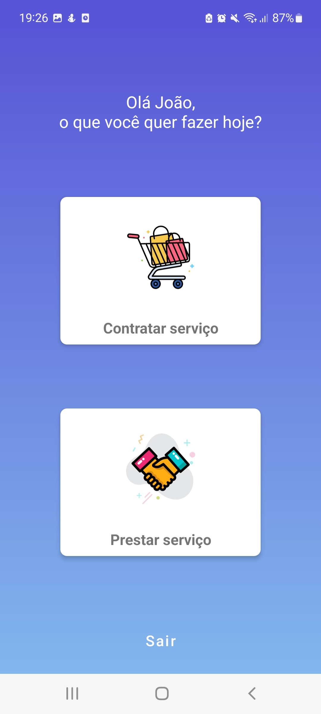</img>
  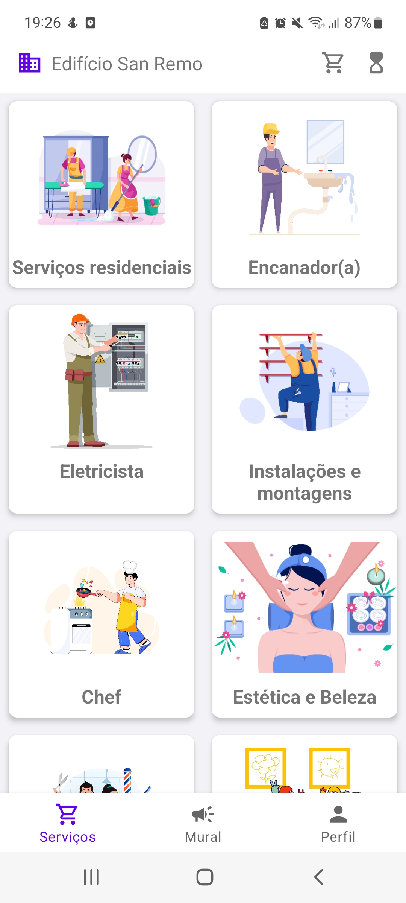</img>
  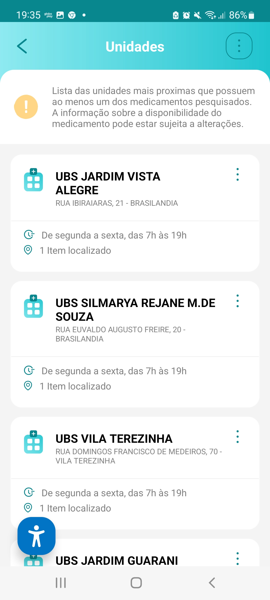</img>
  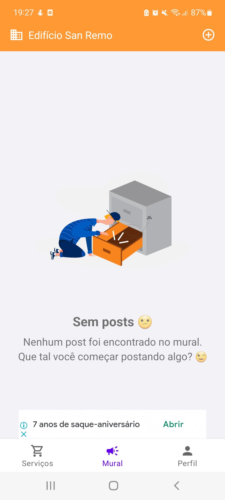</img>

- **Aqui tem Remédio:** Aplicativo criado pela prefeitura de São Paulo para facilitar a procura e acesso da população de São Paulo a diversos remédios de diversos tipos. O aplicativo possui um sistema de busca baseado na sua localização, onde você digita o nome do remédio e o app retorna unidades próximas que possuem o remédio procurado, juntamente com eu horário de funcionamento e endereço. Além disso, uma funcionalidade interessante que o aplicativo possui é um link direto para uma página com uma relação de medicamentos oferecidos pelo SUS e onde eles costumam estar disponíveis.

  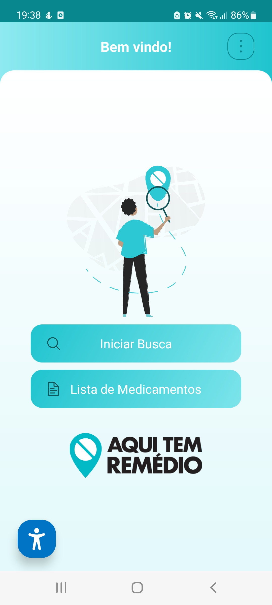</img>
  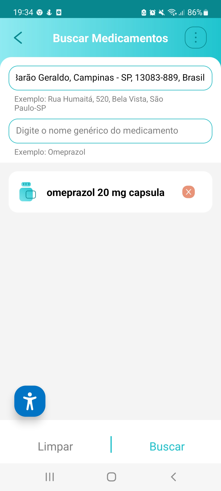</img>
  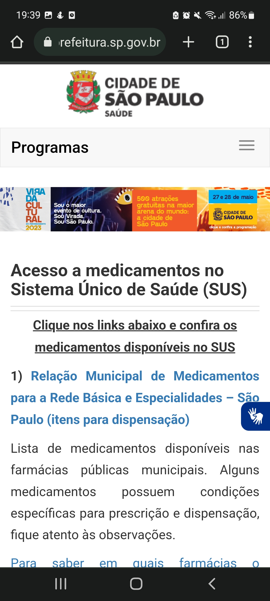</img>

Outros produtos no mercado voltado para a proteção feminina:
- **Clique 180:** O app serve para denunciar toda forma de violência de gênero. Além disso, disponibiliza a Lei Maria da Penha para consulta, algumas funcionalidades e interações, além da possibilidade de ligação direta para o 180, contato para denunciar casos de violência contra a mulher.
- **bSafe:** Você pode cadastrar e acionar contatos de confiança caso saia sozinha e não se sinta segura, assim que apertar o botão de emergência. Na hora de sair de casa, também pode convidar um amigo para que acompanhe toda sua trajetória por GPS. Um alarme opcional também pode ser acionado, tocando uma sirene e começando a filmagem e gravação de tudo que está acontecendo.
- **Circle of 6:** Você pode escolher seis amigos de confiança para fazer parte do seu círculo. Usando o aplicativo, você poderá mandar um alerta automático com sua localização exata para todas elas. Ideal para quando, em uma viagem, você se perde dos demais membros da turma, ou mesmo em um caso de um encontro às cegas que se mostrou uma cilada.
- **Femitaxi:** Um táxi exclusivo para mulheres, guiado por outras mulheres. Entre os aplicativos para segurança, é um dos mais eficazes para aquelas que se sentem inseguras para sair à noite ou mesmo para pegar uma carona de transporte por app.
- **Sai pra lá:** Aplicativo especificamente para mulheres relatarem e se manterem informadas sobre casos de assédio. As mulheres podem relatar e detalhar casos de assédio que sofreram, para que as outras fiquem informadas e possam evitar zonas com assédios mais frequentes ou invasivos. Funcionalidades disponíveis: mapa para mostrar ocorrências próximas ao usuário, cadastro e detalhamento de ocorrências (local, tipo e gravidade da ocorrência e descrição do agressor).

  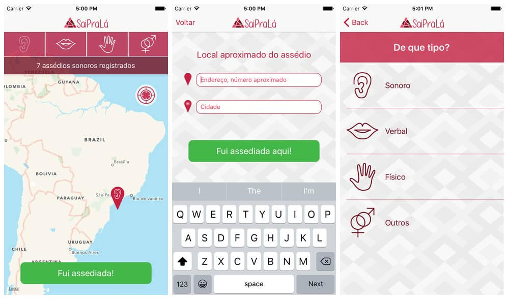</img>

### Pontos de atenção encontrados
Em tempos da inovação tecnológica e da ascensão do digital, aplicativos relacionados à vizinhança são uma realidade no Brasil e no exterior. Dentre eles, há os que buscam uma humanização, a retomada da interação entre os habitantes de um bairro; há também os que mobilizam o estado de vigilância.

Um aplicativo pioneiro nesta área é o *Nextdoor*, lançado nos Estados Unidos em 2011. O objetivo é que ele mobilize a interação entre pessoas de uma vizinhança por meio de mensagens, eventos, pesquisas ou alertas. Segundo a empresa, eles são uma rede social baseada na proximidade, e não na preferência. Uma pessoa pode, por exemplo, solicitar uma recomendação de serviços locais e alguém próximo poderá contatá-lo como em um fórum digital.

Porém, considerando a subjetividade humana do que é um alerta de segurança e o que se apresenta como perigo, podemos fazer um paralelo e nos atentar a um episódio controverso do aplicativo *Nextdoor* envolvendo preconceito racial. Na Califórnia, foi descoberto que alguns moradores estavam usando o aplicativo para rotular pessoas afro-descendentes como perigosos ao bairro, por exemplo. Após o incidente, a *Nextdoor* tomou providências e criou novos parâmetros para não haver menções raciais em um primeiro plano. Por isso, o meio digital e nossa aplicação precisa de atenção e parâmetros para não se tornar um ambiente tóxico e/ou de conflitos.

Além disso, ao pesquisar soluções/aplicações de segurança encontramos uma reportagem que levantou um ponto interessante para avaliarmos ao tratar de segurança. A reportagem publicada originalmente no site “Outra Cidade”, em 02 de setembro de 2016, (disponível em https://outracidade.com.br/waze-cria-alerta-para-avisar-sobre-areas-que-considera-perigosas/) relata sobre o aplicativo *Waze* criar alertas aos seus usuários para avisar sobre áreas que considera perigosas. Este alerta de risco foi disponibilizado pelo *Waze* apenas para usuários que circulavam no Rio de Janeiro, na época da reportagem (foi observado que tal funcionalidade foi implantada na cidade de São Paulo posteriormente).

O funcionamento desta *feature* ocorre da seguinte maneira: caso o usuário esteja circulando sem uma rota determinada com o aplicativo ligado e se aproximar de algum desses locais (“perigosos”), ele recebe uma notificação na tela e um aviso de voz. São 25 áreas marcadas “por terem maior índice de crime e menor quantidade de solicitações de rotas do *Waze*”, comunica a empresa.

O site complementou que a assessoria de imprensa do *Waze* informou por e-mail que não divulga quais as regiões onde o alerta aparece e que não é possível visualizá-las reduzindo o zoom no mapa. “Por respeito àqueles que moram nessas áreas, evitamos rotulá-los para a população em geral no mapa ou em comentários”. Um site de notícias locais diz que a Rocinha foi marcada como um lugar perigoso e que os moradores não ficaram felizes com isso.

A credibilidade das informações e alertas apresentados, segundo a empresa, tem como base de dados do Disque Denúncia e “de terceiros, recebido de outros”. São essas fontes de informação que conferem credibilidade à informação e agregam valor ao próprio *Waze*. A empresa afirma que os dados incluem os seguintes crimes: roubo de carros, homicídios, assalto a carros, tráfico de drogas, entre outros.
